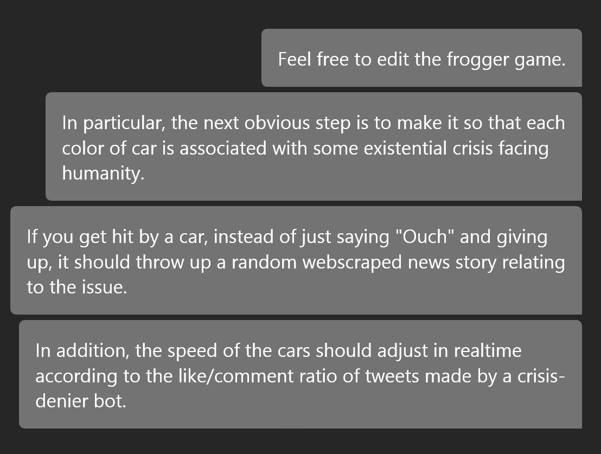

**Welcome to Doom Frogger** 

Do you worry about existential crises?  Famine?  Pestilence? Machine Superintelligence?  Do you wish you could just put  blinders, and all the bad things would go away?

If so, then this is the game for you.

1. Doom Frogger is a simple game.  Use the arrow keys to navigate the screen.  Be careful - there are occasionally 
inconvenient truths zipping across.  They can really sting!
2. To counteract the sting of these carbingers of doom, collect roses.  They smell nice, and can distract you from the bad news that pervades.
3. If you run out of roses, then your next bit of bad news might do you in.

## BACKGROUND:
This project came about as an extension of a fairly simple Class-creating exercise in the Udemy 100 Days of Code course.  The original project was meant to be created using turtle graphics, and had black rectangular cars moving left to right and allowed the frog to move forward and left/right (but not at angles or backwards).

@Pigankle shared the simple project with @Sashkaw 

Sashkaw took the challenge, and developed the webscraping module to display thematic headlines.  (We decided not to create the tie-in crisis-denying bots in order to prevent real-world harm)  

To improve performance and allow for more sparkle, the whole game was rewritten using the arcade engine.

## KNOWN MAJOR ISSUES

* Unfortunately, the way the Arcade engine uses the GPU is incompatible with the way that web browsers use the GPU.  It is not possible to embed this game on a website unless it is totally rewritten with a different engine (e.g. pygame).

Since neither Pigankle nor Sashkaw is particularly angling to write video games, development is paused as of late November 2022.   